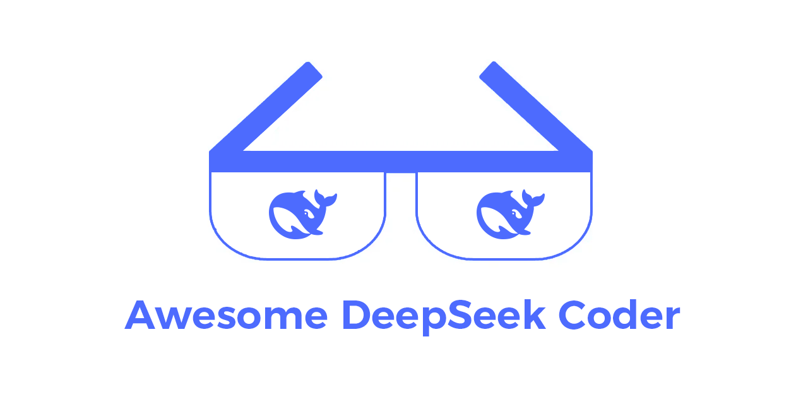
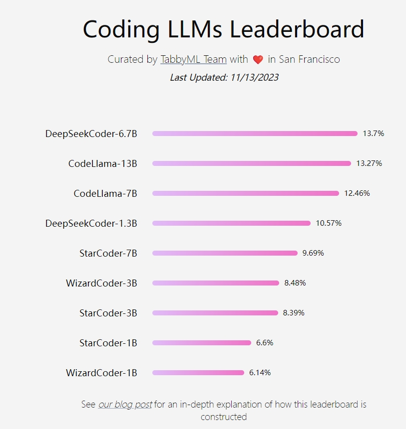

# awesome-deepseek-coder 

A curated list of open-source projects related to DeepSeek Coder.

## Chat with DeepSeek Coder
Chat Website: [coder.deepseek.com](https://coder.deepseek.com/)

## Official Resources
### Released Models
All models are available on Hugging Face: [huggingface.co/deepseek-ai](https://huggingface.co/deepseek-ai)
| Model Size | Base | Instruct |
|------------|------|----------|
| **1.3B**        | [deepseek-coder-1.3b-base](https://huggingface.co/deepseek-ai/deepseek-coder-1.3b-base) | [deepseek-coder-1.3b-instruct](https://huggingface.co/deepseek-ai/deepseek-coder-1.3b-instruct) |
| **5.7B**     | [deepseek-coder-5.7bmqa-base](https://huggingface.co/deepseek-ai/deepseek-coder-5.7bmqa-base) | [deepseek-coder-5.7bmqa-instruct](https://huggingface.co/deepseek-ai/deepseek-coder-5.7bmqa-instruct)(coming soon) |
| **6.7B**       | [deepseek-coder-6.7B-base](https://huggingface.co/deepseek-ai/deepseek-coder-6.7B-base) | [deepseek-coder-6.7B-instruct](https://huggingface.co/deepseek-ai/deepseek-coder-6.7B-instruct) |
| **33B**         | [deepseek-coder-33B-base](https://huggingface.co/deepseek-ai/deepseek-coder-33B-base) | [deepseek-coder-33B-instruct](https://huggingface.co/deepseek-ai/deepseek-coder-33B-instruct) |

## Community Resources

### Quantized Models 

- [TheBloke](https://huggingface.co/TheBloke) - TheBloke develops AWQ/GGUF/GPTQ format model files for DeepSeek's Deepseek Coder 1B/7B/33B models.

| Model Size | Base | Instruct |
|------------|------|----------|
| **1.3B**   | [deepseek-coder-1.3b-base-AWQ](https://huggingface.co/TheBloke/deepseek-coder-1.3b-base-AWQ)   [deepseek-coder-1.3b-base-GGUF](https://huggingface.co/TheBloke/deepseek-coder-1.3b-base-GGUF)   [deepseek-coder-1.3b-base-GPTQ](https://huggingface.co/TheBloke/deepseek-coder-1.3b-base-GPTQ) | [deepseek-coder-1.3b-instruct-AWQ](https://huggingface.co/TheBloke/deepseek-coder-1.3b-instruct-AWQ)   [deepseek-coder-1.3b-instruct-GGUF](https://huggingface.co/TheBloke/deepseek-coder-1.3b-instruct-GGUF)   [deepseek-coder-1.3b-instruct-GPTQ](https://huggingface.co/TheBloke/deepseek-coder-1.3b-instruct-GPTQ) |
| **5.7B**   | [deepseek-coder-5.7bmqa-base-AWQ](https://huggingface.co/TheBloke/deepseek-coder-5.7bmqa-base-AWQ)   [deepseek-coder-5.7bmqa-base-GGUF](https://huggingface.co/TheBloke/deepseek-coder-5.7bmqa-base-GGUF)   [deepseek-coder-5.7bmqa-base-GPTQ](https://huggingface.co/TheBloke/deepseek-coder-5.7bmqa-base-GPTQ) | [deepseek-coder-5.7bmqa-instruct-AWQ](https://huggingface.co/TheBloke/deepseek-coder-5.7bmqa-instruct-AWQ)(coming soon)   [deepseek-coder-5.7bmqa-instruct-GGUF](https://huggingface.co/TheBloke/deepseek-coder-5.7bmqa-instruct-GGUF)(coming soon)   [deepseek-coder-5.7bmqa-instruct-GPTQ](https://huggingface.co/TheBloke/deepseek-coder-5.7bmqa-instruct-GPTQ)(coming soon) |
| **6.7B**   | [deepseek-coder-6.7B-base-AWQ](https://huggingface.co/TheBloke/deepseek-coder-6.7B-base-AWQ)   [deepseek-coder-6.7B-base-GGUF](https://huggingface.co/TheBloke/deepseek-coder-6.7B-base-GGUF)   [deepseek-coder-6.7B-base-GPTQ](https://huggingface.co/TheBloke/deepseek-coder-6.7B-base-GPTQ) | [deepseek-coder-6.7B-instruct-AWQ](https://huggingface.co/TheBloke/deepseek-coder-6.7B-instruct-AWQ)   [deepseek-coder-6.7B-instruct-GGUF](https://huggingface.co/TheBloke/deepseek-coder-6.7B-instruct-GGUF)   [deepseek-coder-6.7B-instruct-GPTQ](https://huggingface.co/TheBloke/deepseek-coder-6.7B-instruct-GPTQ) |
| **33B**    | [deepseek-coder-33B-base-AWQ](https://huggingface.co/TheBloke/deepseek-coder-33B-base-AWQ)   [deepseek-coder-33B-base-GGUF](https://huggingface.co/TheBloke/deepseek-coder-33B-base-GGUF)   [deepseek-coder-33B-base-GPTQ](https://huggingface.co/TheBloke/deepseek-coder-33B-base-GPTQ) | [deepseek-coder-33B-instruct-AWQ](https://huggingface.co/TheBloke/deepseek-coder-33B-instruct-AWQ)   [deepseek-coder-33B-instruct-GGUF](https://huggingface.co/TheBloke/deepseek-coder-33B-instruct-GGUF)   [deepseek-coder-33B-instruct-GPTQ](https://huggingface.co/TheBloke/deepseek-coder-33B-instruct-GPTQ) |

### Copilot
[Tabby](https://github.com/TabbyML/tabby), a self-hosted and open-source AI coding assistant, presents itself as a formidable alternative to GitHub Copilot. Its latest leaderboard showcases deepseek-coder-6.7B as the top performer in code completion (https://leaderboard.tabbyml.com/).  Dive in and explore the robust code completion features of DeepSeek Coder with Tabby [(link)](https://tabby.tabbyml.com/docs/models/).

[AutoDev](https://github.com/unit-mesh/auto-dev), an open-source JetBrains' IDE AI coding assistant. It provide Deepseek 6.7b finetune data tools by [Unit Eval](https://github.com/unit-mesh/unit-eval), related to AutoDev prompts' [datasets](https://huggingface.co/datasets/unit-mesh/unit-eval-completion) and [finetuned model](https://huggingface.co/unit-mesh/autodev-deepseek-6.7b-finetunes), and [API server example](https://github.com/unit-mesh/unit-eval/blob/master/finetunes/deepseek/api-server-python38.py)

### APIs
- [limcheekin/deepseek-coder-6.7B-instruct-GGUF](https://huggingface.co/spaces/limcheekin/deepseek-coder-6.7B-instruct-GGUF): limcheekin provides API for `deepseek-coder-6.7B-instruct-GGUF` model.

## Contributing
Excited to see the awesome stuff you guys will create with DeepSeek Coder!

